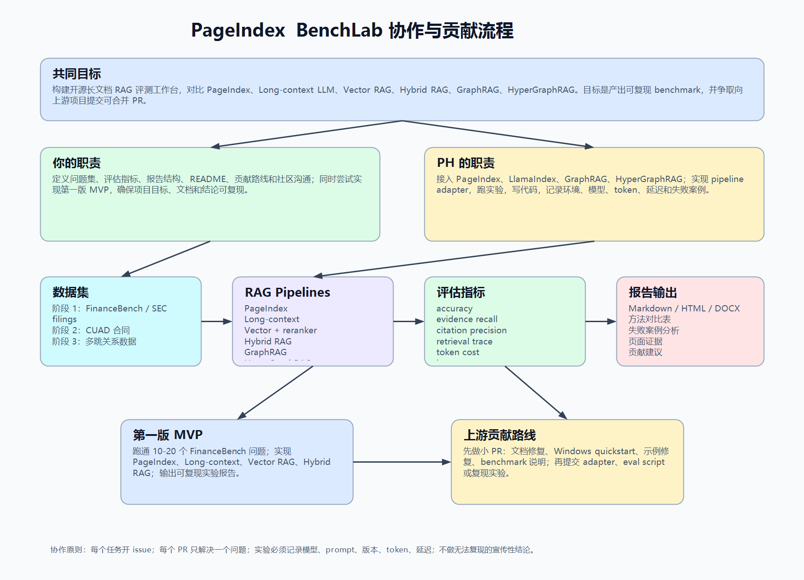

# PageIndex BenchLab

An open benchmark workspace for evaluating **PageIndex** against long-context LLMs, Vector RAG, Hybrid RAG, GraphRAG, and HyperGraphRAG on structured long-document question answering.

## Why This Project Exists

PageIndex proposes a document-native, tree-based retrieval approach for long documents. Instead of only asking whether PageIndex is "better than RAG", this project asks a narrower and more useful question:

> On structured long documents such as SEC filings, annual reports, contracts, and technical manuals, can PageIndex retrieve better evidence, produce more precise citations, and provide a more explainable retrieval path than other RAG methods?

The benchmark focuses on:

- `answer_accuracy`
- `evidence_recall`
- `citation_precision`
- `unsupported_claim_rate`
- `retrieval_explainability`
- `token_cost`
- `latency`
- `indexing_cost`

## Compared Methods

| Method | Role in this benchmark | Source |
|---|---|---|
| PageIndex | Main method under evaluation | https://github.com/VectifyAI/PageIndex |
| Long-context LLM | Strong baseline: put the full document in context | https://platform.openai.com/docs/api-reference/responses/create |
| Vector RAG + reranker | Traditional strong semantic retrieval baseline | https://github.com/run-llama/llama_index |
| Hybrid RAG | BM25 + vector retrieval + fusion/rerank baseline | https://docs.llamaindex.ai/ |
| GraphRAG | Graph-based baseline for entity and relationship analysis | https://github.com/microsoft/graphrag |
| HyperGraphRAG | Hypergraph baseline for n-ary facts and multi-hop reasoning | https://github.com/LHRLAB/HyperGraphRAG |

## First Milestone

The first milestone is intentionally small:

- Use `FinanceBench` / SEC filing questions.
- Run 10-20 questions first.
- Compare:
  - PageIndex
  - Long-context LLM
  - Vector RAG + reranker
  - Hybrid RAG
- Generate a reproducible Markdown or HTML report.
- Use the results to prepare small upstream PRs for PageIndex and related RAG projects.

FinanceBench source:

- https://github.com/patronus-ai/financebench
- https://arxiv.org/abs/2311.11944

## Current Stage

Status: **Stage 1 - MVP Benchmark Setup**.

Completed:

- PageIndex local demo ran successfully with DashScope/Qwen through LiteLLM.
- PageIndex demo tree output is stored under `examples/pageindex-demo/`.
- Unified benchmark schema exists in `benchlab/schemas.py`.
- FinanceBench MVP subset exists in `datasets/financebench/mvp_questions.jsonl`.
- PageIndex tree adapter exists in `pipelines/pageindex/adapter.py`.
- Evidence page evaluator exists in `evaluators/evidence.py`.
- Upstream PageIndex dependency issue draft exists in `docs/upstream-pageindex-dependency-issue.md`.
- FinanceBench MVP PDFs can be downloaded with `scripts/download_mvp_pdfs.py`.
- PageIndex batch indexing can be run with `scripts/run_pageindex_mvp.py` after setting a provider API key.
- PageIndex structures have been generated for all 11 unique MVP PDFs.
- PageIndex retrieval-only QA has been run for all 12 MVP questions.
- Current PageIndex no-LLM evidence result: average evidence recall `1.000`, average citation precision `0.333`.
- Long-context baseline code exists and the no-LLM smoke test has been run for all 12 MVP questions.
- Current Long-context no-LLM smoke result: average evidence recall `0.583`, average citation precision `0.194`.
- PageIndex LLM answer generation has been run for all 12 MVP questions with `deepseek/deepseek-v4-pro`.
- Long-context LLM answer generation has been run for all 12 MVP questions with `deepseek/deepseek-v4-pro`.
- Vector RAG + reranker MVP has been run for all 12 MVP questions with `deepseek/deepseek-v4-pro`.
- Hybrid RAG MVP has been run for all 12 MVP questions with `deepseek/deepseek-v4-pro`.
- Current LLM evidence results:
  - PageIndex: average evidence recall `1.000`, average citation precision `0.333`.
  - Long-context: average evidence recall `0.917`, average citation precision `0.306`.
  - Vector RAG + reranker MVP: average evidence recall `1.000`, average citation precision `0.333`.
  - Hybrid RAG MVP: average evidence recall `1.000`, average citation precision `0.333`.
- Current LLM-judge answer accuracy:
  - PageIndex: `1.000`
  - Long-context: `1.000`
  - Vector RAG + reranker MVP: `0.917`
  - Hybrid RAG MVP: `1.000`
- Current average total tokens per answer:
  - PageIndex: `2,984`
  - Long-context: `84,843`
  - Vector RAG + reranker MVP: `2,299`
  - Hybrid RAG MVP: `2,413`
- Detailed evidence-backed reports now exist:
  - `reports/stage1_detailed_evidence_report.md`
  - `reports/stage1_per_question_results.csv`
  - `reports/stage1_validation_report.json`
- LlamaIndex Vector and Hybrid diagnostic baselines now have a label-free finance-aware reranker.
- Current finance-aware LlamaIndex retrieval-only diagnostics:
  - LlamaIndex Vector RAG: average evidence recall `1.000`, average citation precision `0.333`.
  - LlamaIndex Hybrid RAG: average evidence recall `1.000`, average citation precision `0.333`.
- LlamaIndex finance-aware LLM diagnostics can be run with `scripts/run_llamaindex_finance_llm_diagnostics.py`, but these candidates are not yet promoted into the main answer-level table.

Current owner: project owner. PH is on standby for later task assignment.

See:

- [Stage 1 status](docs/stage-1-status.md)
- [Benchmark schema](docs/schema.md)

## Project Structure

```text
pageindex-benchlab/
  README.md
  CONTRIBUTING.md
  docs/
    collaboration-plan.md
    rag-method-comparison-sources.md
    pageindex-rag-workflow.png
  datasets/
    README.md
  pipelines/
    pageindex/
    long_context/
    vector_rag/
    hybrid_rag/
    graphrag/
    hypergraphrag/
  evaluators/
  examples/
  reports/
```

## Collaboration Plan

Workflow overview:



Detailed planning documents:

- [Collaboration plan](docs/collaboration-plan.md)
- [RAG method comparison and sources](docs/rag-method-comparison-sources.md)

## Output Schema

Each pipeline should eventually produce the same JSON-compatible result shape. The canonical models are in `benchlab/schemas.py`:

```json
{
  "method": "pageindex",
  "question_id": "q001",
  "question": "What was the company's operating income in 2023?",
  "answer": "...",
  "citations": [
    {
      "document_id": "example_10k",
      "page": 42,
      "section": "Item 7",
      "text": "..."
    }
  ],
  "retrieval_trace": [
    {
      "step": 1,
      "action": "inspect_tree",
      "target": "Item 7"
    }
  ],
  "token_usage": {
    "input": 12000,
    "output": 800
  },
  "latency_ms": 8400
}
```

## Team Roles

### Project Owner

Responsibilities:

- Define question sets.
- Define evaluation metrics.
- Design reports and README.
- Maintain the contribution roadmap.
- Communicate with upstream communities.
- Try to implement the first MVP.

### PH

Responsibilities:

- Connect PageIndex.
- Connect LlamaIndex.
- Connect GraphRAG.
- Connect HyperGraphRAG.
- Build pipeline adapters.
- Run experiments.
- Write benchmark code.
- Record environment, model versions, token usage, latency, and failure cases.

## Suggested Roadmap

### Week 1

- Set up this repository.
- Add the collaboration plan.
- Run the PageIndex demo locally.
- Select 10-20 FinanceBench questions.
- Define the unified output schema.

### Week 2

- Implement the PageIndex adapter.
- Implement the Vector RAG + reranker baseline.
- Implement `evidence_recall` and `citation_precision`.
- Generate the first report from 10 questions.

### Week 3

- Implement Hybrid RAG.
- Implement or improve the Long-context baseline.
- Collect failure cases.
- Open a PageIndex issue describing the benchmark plan.

### Week 4

- Release `v0.1`.
- Submit the first small upstream PR.
- Improve documentation.
- Plan GraphRAG and HyperGraphRAG integration.

## Upstream Contribution Strategy

Do not start with a large feature PR. Start with small, easy-to-review contributions:

- Documentation fixes.
- Windows quickstart.
- `.env.example`.
- Example fixes.
- Benchmark reproduction notes.
- Small evaluation scripts.

Recommended first PageIndex PR:

```text
docs: add Windows quickstart and minimal local PDF example
```

## Hardware Requirements

The first milestone does **not** require a local GPU.

Recommended first setup:

- Python 3.10+
- Git
- 16 GB RAM preferred
- LLM API key, such as OpenAI / Gemini / Claude
- Small local reranker or API-based reranker

A GPU may become useful later for local LLMs, large embedding jobs, or large rerankers, but it is not required to become a contributor or run the first benchmark.

## Next Actions

1. Run LlamaIndex finance-aware LLM answer generation and answer judging.
2. Expand the FinanceBench subset beyond 12 questions.
3. Add per-method failure-case notes and cost estimates.
4. Prepare a PageIndex upstream issue or PR using the benchmark findings.
5. Add GraphRAG and HyperGraphRAG after the larger subset is stable.
